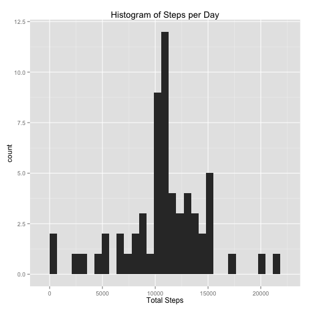

Reproducible Research - Peer Assessment: # 1
-----------------------------------

Assignment work by: csbyjw
       on: 2014-05-18

## Read in the data (activity.csv)

This code sets the working directory for this assignment repository then attempts
to load the file activity.csv from the top level of the directory


```r
library(ggplot2)
setwd("~/Documents/Coursera/Data Science/code")
activity <- read.csv("activity.csv", header = TRUE, stringsAsFactors = FALSE)
```


## Reshape the data

Agg the data by day and by interval for later computations
then store the result in .bydate and .byinterval frames. Calc the mean, median, 
and total for each agg then store the result in .mn, .md, and .total variables


```r
activity.byday <- aggregate(steps ~ date, data = activity, FUN = sum)
activity.byinterval <- aggregate(steps ~ interval, data = activity, FUN = mean)
str(activity.byday)
```

```
## 'data.frame':	53 obs. of  2 variables:
##  $ date : chr  "2012-10-02" "2012-10-03" "2012-10-04" "2012-10-05" ...
##  $ steps: int  126 11352 12116 13294 15420 11015 12811 9900 10304 17382 ...
```

```r
str(activity.byinterval)
```

```
## 'data.frame':	288 obs. of  2 variables:
##  $ interval: int  0 5 10 15 20 25 30 35 40 45 ...
##  $ steps   : num  1.717 0.3396 0.1321 0.1509 0.0755 ...
```


## What is the mean total number of steps per day?

Histogram of frequency of steps:

```r
qplot(steps, data = activity.byday, main = "Histogram of Steps per Day", xlab = "Total Steps")
```

```
## stat_bin: binwidth defaulted to range/30. Use 'binwidth = x' to adjust this.
```

 


Calc the mean and the median:

```r
mean_steps <- mean(activity.byday$steps, na.rm = TRUE)
median_steps <- median(activity.byday$steps, na.rm = TRUE)
```


The mean number of steps per day is 10766 and the median is 10765.

## What is the avg daily activity pattern?

Line plot of avg steps per interval:

```r
qplot(interval, steps, data = activity.byinterval) + geom_line()
```

 


Find the interval with the highest avg steps:

```r
max_interval <- activity.byinterval[activity.byinterval$steps == max(activity.byinterval$steps), 
    "interval"]
```


The interval with the most steps is 835

## Imputing missing values

Calculate number of NA rows:

```r
missing <- sum(is.na(activity$steps))
```


There are 2304 rows with missing data.

Copying the data structure to activity.filled and replace NA steps values
with the mean for the interval (11/30 is missing, so by date is a problem)

```r
activity.filled <- activity
for (i in 1:nrow(activity.filled)) {
    r <- activity.filled[i, ]
    if (is.na(r$steps)) {
        activity.filled[i, "steps"] <- activity.byinterval[activity.byinterval$interval == 
            r$interval, "steps"]
    }
}
```


Agg filled data by day and plot the histogram.

```r
activity.filled.byday <- aggregate(steps ~ date, data = activity.filled, FUN = sum)
qplot(steps, data = activity.filled.byday, main = "Histogram of Steps per Day", 
    xlab = "Total Steps")
```

```
## stat_bin: binwidth defaulted to range/30. Use 'binwidth = x' to adjust this.
```

 


Calc mean and median:

```r
mean_steps_f <- mean(activity.filled.byday$steps, na.rm = TRUE)
median_steps_f <- median(activity.filled.byday$steps, na.rm = TRUE)
```


The mean number of steps per day is 10766 and
the median is 10766. 

### Result: The values are slightly skewed due to the imputation.

## Are the activity patterns different between weekends and weekdays?

Create a new factor for weekend vs. weekday on activity.filled

```r
activity.filled$weekend <- factor(weekdays(as.Date(activity.filled$date)) %in% 
    c("Saturday", "Sunday"), labels = c("Weekday", "Weekend"))
```


Plot the results of mean by interval, faceted by weekend factor. 

```r
activity.filled.byintv_wday <- aggregate(steps ~ interval + weekend, data = activity.filled, 
    FUN = mean)
qplot(interval, steps, data = activity.filled.byintv_wday, facets = weekend ~ 
    ., main = "Average Steps per Interval", xlab = "Total Steps") + geom_line()
```

 

